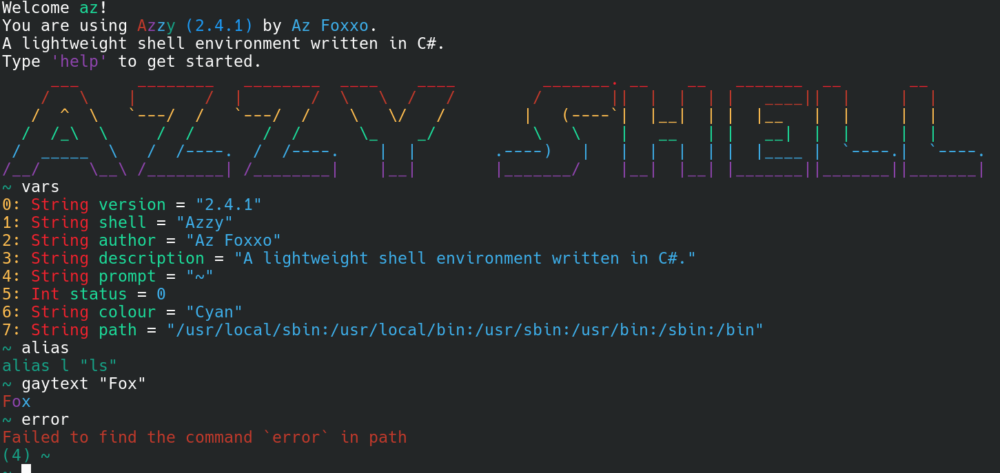

# Azzy Shell

Azzy Shell is a lightweight shell environment written in C#

Note: The shell doesn't parse input into tokens and only does the absolute basics to interpret commands.



## Supported commands
```
quit - Quit the app
help - Show this help message
ls - List all files and directories in the current directory
pwd - Print the current directory
clear - Clear the console
cd - Change the current directory
touch - Create a new file
mkdir - Create a new directory
remove - Remove a file or directory
cat - Print the contents of a file
log - Log a message to the console
fizzbuzz - Print the FizzBuzz sequence up to a given number
set - Set a variable
vars - List all variables
logo - Print the Azzy logo
hacker - Print 0 and 1 in a hacker style
gaytext - Print a message in gay colours
history - Print the command history
run - Run a Azzy Shell Script file line-by-line
alias - Create/update and view aliases
```

## Azzy Shell Script

AzzyShell uses AzzyShell Script (ASS) for scripts.

### Configuration

If a file called `~/.azzyshell_init.ass` is present, the shell will skip the usual init and run the custom one.

### Variables

Additionally, the shell supports multiple commands using `&&` and defining and using variables.
Using `[variable]` will return that variable's type.
Using `{variable}` will return it's value.
Using `(variable)` will return the name of the variable.
Using `<variable>` will return the index of the variable.

### Special characters
`@DOUBLE@` for `"`
`@AND@` for `&&`
`@NEWLINE@` for `\n` (newline)
`@TAB@` for `\t` (tab)
`@AT@` for `@`
`@HASH@` for `#`

### External commands

If a command is not found, it will search the `path` for the executable.

### Comments

Comments can be created by using `#` and anything following it will be skipped until a newline.
