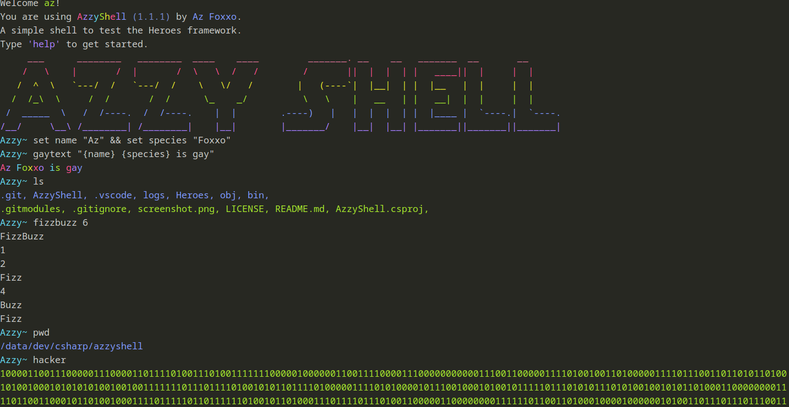

# Azzy Shell
Azzy Shell is a simple shell written in C# and the Heroes framework.

The Heroes framework can be found [here](https://github.com/azFoxxo/heroes).

Note: The shell doesn't parse input into tokens and only does the absolute basics to work as this is solely designed to test the framework. 



Supported commands in shell:
```
quit - Quit the app
help - Show this help message
ls - List all files and directories in the current directory
pwd - Print the current directory
clear - Clear the console
cd - Change the current directory
touch - Create a new file
mkdir - Create a new directory
remove - Remove a file or directory
cat - Print the contents of a file
log - Log a message to the console
fizzbuzz - Print the FizzBuzz sequence up to a given number
set - Set a variable
vars - List all variables
logo - Print the Azzy logo
hacker - Print 0 and 1 in a hacker style
gaytext - Print a message in gay colours
```

Additionally, the shell supports multiple commands using `&&` and defining and using variables.
Using `[variable]` will return that variable's type.
Using `{variable}` will return it's value.
Using `(variable)` will return the name of the variable.
Using `<variable>` will return the index of the variable.

Special characters are:
`@DOUBLE@` for `"`
`@AND@` for `&&`
`@NEWLINE@` for `\n` (newline)
`@TAB@` for `\t` (tab)
`@AT@` for `@`

Use `!` at the start of the command to find a program installed on the system.